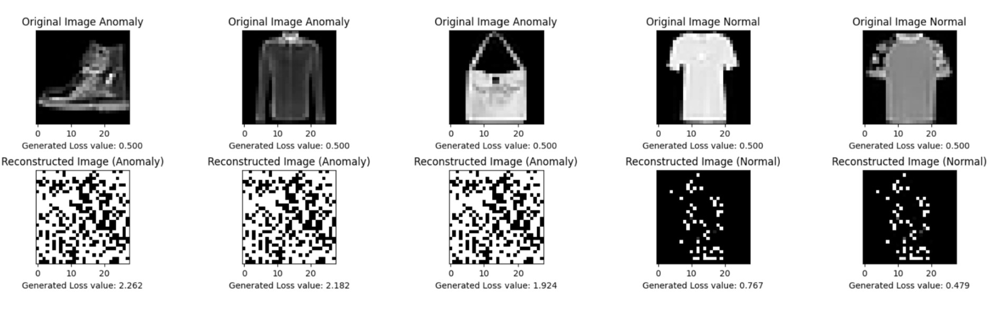

# Project Title:
**Anomaly Detection On FashionMNIST Dataset**

# Overview:
In this repository, I am designing a model to find anomalies in FashionMNIST data. Here I am designing two different approaches: one is a baseline approach and the other is a State-of-the-art (SOTA) model. The project was developed as part of the **DEEP LEARNING** course, taught by Professor [FABRIZIO SILVESTRI](https://corsidilaurea.uniroma1.it/en/users/fabriziosilvestriuniroma1it), within my Master’s in Artificial Intelligence and Robotics at the [Sapienza University of Rome](https://www.uniroma1.it/it/pagina-strutturale/home), showcasing the practical application of advanced concepts in a real-world scenario.

<h1>
Introduction:
</h1>
  Anomaly detection in images involves identifying abnormal unusual patterns within a given dataset of images.

<h2>For Example:</h2>

Let's suppose, We have an Apple packaging industry, and our task is to pack only Fresh apples (Normal), But most of the time we get rotten apples, So for that we have to apply anomaly detection in such a way that It's classified 'Fresh apples' as (Normal) and 'Rotten Apples' as (Anomaly). By applying anomaly detection, the system can analyze the visual characteristics of the apples, such as color, texture, shape, and any signs of decay or spoilage. The majority of the normal or fresh apples should be classified as "normal," indicating they meet the quality criteria for packaging. On the other hand, any apples exhibiting anomalies associated with rot, such as discoloration, mold, or a soft texture, should be classified as "anomalies" and rejected from the packaging process.

<h1>Task Description:</h1>
Our task is to find out anomaly detection in FashionMNIST dataset. Anomaly detection
on FashionMNIST refers to the process of identifying unusual or anomalous patterns in
the FashionMNIST dataset. FashionMNIST is a popular benchmark dataset in the field
of computer vision, consisting of 60,000 labeled images of 10 different fashion
categories, such as T-shirts, dresses, shoes, and bags. Each image is a 28x28
grayscale picture.
Anomaly detection aims to find instances that deviate significantly from the normal
patterns present in the dataset. In the context of FashionMNIST, anomalies can be
images that do not belong to any of the predefined fashion categories or images that
exhibit unusual or unexpected characteristics compared to the majority of the dataset.
<h1>What is our approach:</h1>
Here to find out anomalies in FashionMNIST dataset, I am considering one
FashionMNIST class (label) as normal and rest of nine classes as anomaly.
<ol>
  <li>
    <b>Normal</b>
    <ul><li>Class 0 (T-shirt/top)</li></ul>
    </li>
 
<li><b>Anomaly</b></li>
  <ul>
<li>Class 1 (Trouser)</li>
<li>Class 2 (Pullover)</li>
<li>Class 3 (Dress)</li>
<li>Class 4 (Coat)</li>
<li>Class 5 (Sandal)</li>
<li>Class 6 (Shirt)</li>
<li>Class 7 (Sneaker)</li>
<li>Class 8 (Bag)</li>
<li>Class 9 (Ankle boot)</li>
    </ul>
</ol>
Here, I am taken two approaches,
One is the baseline approach, where the model is based on Normal GAN, and
Generator is based on autoencoder. On the other hand, The second approach is
based on a state-of-the-art (SOTA) model, where the model is based on DCGAN,
and Generator is based on autoencoder. This time we try to use different loss
functions according to the research paper.
https://paperswithcode.com/paper/gan-based-anomaly-detection-in-imbalance

<h1>Setup Environment</h1>
<ul>
<li>To access the code click
</li>
<li>To download the pytorch lightning model Go to <a href='https://github.com/Sameer-Ahmed7/Anomaly-Detection-on-FashionMNIST/tree/main/lightning_logs'>lightning_logs</a> section on GitHub</li>
  <li>Make sure install all dependencies.</li>
  <li>Connect to Google Colab GPU (Recommended), because in this notebook, we also see some of the images (results) in every 100th batch. So it is necessary to use GPU.</li>
</ul>

<b>Note:</b>

> 
In this notebook, I used TensorBoard for better visualization. If it doesn't work, please download the logs from the <a href='https://github.com/Sameer-Ahmed7/Anomaly-Detection-on-FashionMNIST/tree/main/lightning_logs'>lightning_logs</a> section on GitHub."

> 
In TensorBoard <b>'version_0' for (Baseline Model)</b>, and <b>'version_1' for (SOTA Model)</b>.

  
  
<h1>Baseline Model:</h1>
The first model is the baseline approach, where the model is based on traditional
GAN, and Generator is based on autoencoder. “I am taken the same
methodology given in the SOTA model research paper”. But here the
approach is traditional GAN instead of DCGAN. And here I am using a single
loss function, Mean Squared Error (MSE) Loss. No multiple losses mention in
the SOTA model paper. The traditional GAN approach and the use of MSE loss
provide a straightforward and easy-to-implement solution. This approach may be
suitable for initial exploratory research or as a baseline to compare against more
complex models.

<h1>Model Architecture:</h1>

<h1>Model Result (Training Data)</h1>

<h1>Model Results (Testing Data):</h1>

<i><b>‘The model has some noise, It’s not generating an accurate image of Normal.’</b></i>

<h1>State-of-the-art (SOTA) Model</h1>
Here, I am using DCGAN instead of GAN. And the losses will be calculated according to the SOTA model paper.
<h1>Model Architecture:</h1>

<h1>Model Result (Training Data)</h1>

<h1>Model Results (Testing Data):</h1>

<i><b>‘The model has not generated noise now, It’s generating approx the same result as a Normal image and changing the image for an anomaly image.’</b></i>

<h1> Result:</h1>

| Model                           | AUROC  (Test Data)  |
|---------------------------------|-----------|
| Baseline Model                  | ≈ 87%    |
| State-of-the-art (SOTA) Model   | ≈ 90%    |

<h1>Conclusion:</h1>

The anomaly detection task for the FashionMNIST dataset is that the SOTA model performs significantly better compared to the baseline model. The SOTA model, based on DCGAN architecture and utilizing specific loss functions designed for anomaly detection, demonstrates superior performance in accurately identifying anomalies within the dataset. By employing convolutional layers, the SOTA model captures spatial features and patterns in the images more effectively, resulting in higher-quality and more realistic image generation. Additionally, the adoption of specialized loss functions tailored for anomaly detection enhances the model's ability to distinguish between normal and anomalous instances, leading to improved AUROC results. Overall, the SOTA model presents a more advanced and effective approach for anomaly detection in the FashionMNIST dataset compared to the baseline model. The results suggest that utilizing DCGAN architecture and incorporating specific loss functions can significantly enhance the model's ability to identify anomalies, providing valuable insights for practical applications in the fashion domain.

